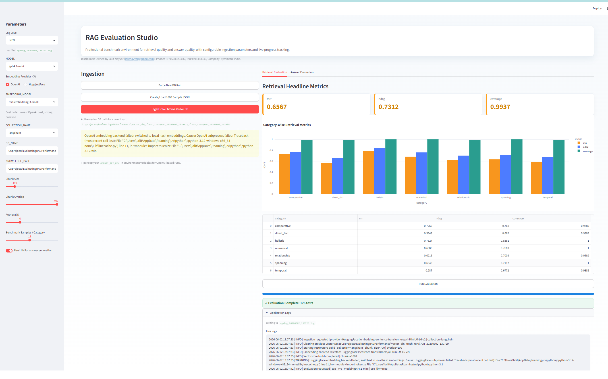

# RAG Evaluation Studio

> Disclaimer (Ownership & Use):
> This application is owned by **Lalit Nayyar** (`lalitnayyar@gmail.com`), Phone: **+971508320336 / +919595353336**, Company: **Symbiotic India**.
>
> It is provided for **internal evaluation, research, and benchmarking** purposes. Re-distribution, external publication of results beyond your organization’s policy, or production deployment without owner consent is discouraged.
>
> You are responsible for complying with applicable laws, network policies, and any third-party service terms used by this application.

**RAG Evaluation Studio** is a professional, light-themed web app to benchmark Retrieval-Augmented Generation end-to-end.

It’s designed to help you quickly compare retrieval quality and answer quality across runs using configurable ingestion + repeatable evaluation.

## Screen Preview

Below is a UI snapshot of the application (for layout reference):



## Key Features

1. **End-to-end benchmark workflow**
   - Generate a synthetic knowledge base (`1000` records in JSON)
   - Ingest into Chroma using LangChain + configurable chunking
   - Run retrieval + answer evaluation with category breakdown

2. **Provider-aware, resilient embeddings**
   - Choose `Embedding Provider` = **OpenAI** or **HuggingFace**
   - Embedding execution is isolated and resilient, with automatic fallback to keep the app running

3. **Professional dashboards**
   - Retrieval: `MRR`, `nDCG`, `Coverage` with category charts
   - Answer: `Accuracy`, `Completeness`, `Relevance` with radar-style comparisons

4. **Ingestion progress & operational controls**
   - Live ingestion progress (split → chunk → embed → batch index)
   - `Force New DB Run` to start fresh anytime
   - DB lock handling with auto-fix and `Reset Session`

5. **Built-in logging**
   - In-app live logs and persisted log file: `applog_YYYYMMDD_HHMMSS.log`
   - Select verbosity from sidebar (`DEBUG`/`INFO`/`WARNING`/`ERROR`)

## Functionality Overview

### 1) Ingestion Pipeline
- Creates `knowledge-base/sample_knowledge.json` (exactly `1000` records)
- Splits documents into chunks using a configurable `Chunk Size` and `Chunk Overlap`
- Creates/updates a Chroma vector DB at `DB_NAME` with:
  - `COLLECTION_NAME`
  - embeddings from the selected provider
- Batch indexing updates the progress meter continuously

### 2) Retrieval Evaluation
For each evaluation query (sampled across benchmark categories), the app computes:
- `MRR` (Mean Reciprocal Rank)
- `nDCG` (Normalized Discounted Cumulative Gain)
- `Coverage` (keyword coverage from the expected keywords)

### 3) Answer Evaluation
The app then scores the generated answer against the expected benchmark signals:
- `Accuracy` (token-based F1, scaled to `/5`)
- `Completeness` (keyword presence, scaled to `/5`)
- `Relevance` (semantic similarity proxy, scaled to `/5`)

## User Guide

### Step A — Setup
1. Install dependencies (recommended):

   ```bash
   uv sync
   ```

2. Create `.env`:

   ```bash
   copy .env.example .env
   ```

3. Set:
- `OPENAI_API_KEY` (only) in `.env` if you choose OpenAI embeddings/LLM.

### Step B — Configure the GUI (Sidebar)
Use the sidebar to select:
- `MODEL`
- `Embedding Provider` (**OpenAI** or **HuggingFace**)
- `EMBEDDING_MODEL`
- `COLLECTION_NAME`
- `DB_NAME`
- `KNOWLEDGE_BASE`
- `Chunk Size`, `Chunk Overlap`
- `Retrieval K`
- `Benchmark Samples / Category`
- `Use LLM for answer generation`
- `Log Level`

### Step C — Ingest
1. Click **Create/Load 1000 Sample JSON**
2. Click **Ingest into Chroma Vector DB**
   - Watch the progress meter update during indexing
3. If you need a clean run:
   - Click **Force New DB Run** (sets a fresh run directory)

### Step D — Evaluate
1. Click **Run Evaluation**
2. Review:
   - **Retrieval Evaluation** tab: `MRR`, `nDCG`, `Coverage` + category charts
   - **Answer Evaluation** tab: `Accuracy`, `Completeness`, `Relevance` + radar chart

### Step E — Logs & Troubleshooting
- Open **Application Logs** to see live logs and confirm ingestion/evaluation steps
- If HuggingFace fails due to SSL/corporate certificate policies:
  - set `REQUESTS_CA_BUNDLE` or `SSL_CERT_FILE` in your environment
- If Chroma DB fails with file-lock:
  - use **Fix DB Lock and Retry Cleanup**
  - if needed, click **Reset Session**

## Tech Stack

- Streamlit (web UI + animations/progress)
- LangChain
- Chroma vector database
- OpenAI (`gpt-4.1-mini`, `text-embedding-3-small`, `text-embedding-3-large`)
- HuggingFace embeddings (`sentence-transformers/all-MiniLM-L6-v2`)

## Quick Start
See the **User Guide** section above (Step A → Step E) for the complete step-by-step walkthrough.
